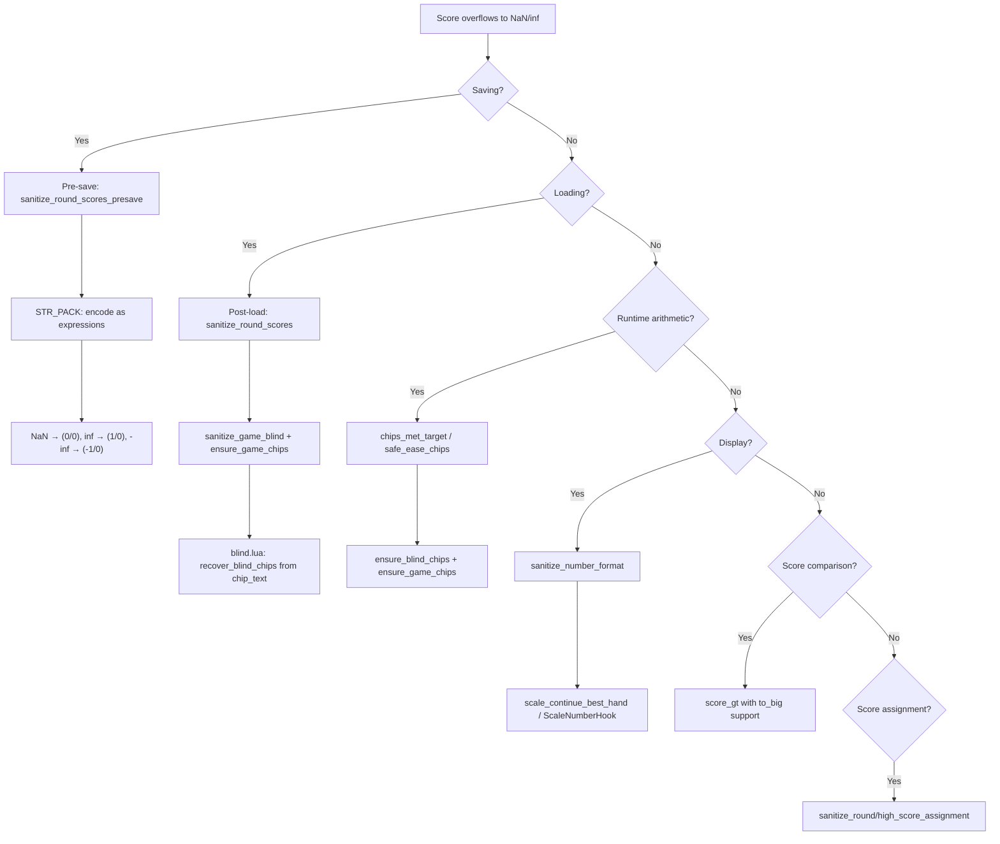

# NaN Protection Flow Documentation

Describes how NaN/inf score values flow through the system and where each defense layer acts.

---

## The Problem

When scores overflow in Lua, they become NaN or infinity:
- `STR_PACK` serializes NaN as literal `nan`, infinity as `inf`
- `loadstring()` unpacks these as undefined globals → `nil`
- Arithmetic on `nil` crashes: `attempt to perform arithmetic on a nil value`

---

## Flow Diagram



---

## Defense Layers

### Layer 1: Serialization (`engine/string_packer.lua`)

Inline patch (hot path, kept inline for performance). Encodes non-finite values as arithmetic expressions that `loadstring()` can evaluate:

| Value | Serialized As | Evaluates To |
|-------|---------------|-------------|
| NaN | `(0/0)` | NaN |
| +inf | `(1/0)` | inf |
| -inf | `(-1/0)` | -inf |

**Blind chips special case**: When serializing `chips` on a blind table with `chip_text`, preserves `-nan` vs `nan` distinction by checking `chip_text`.

**Big-backend bypass**: When Talisman/Amulet-style big-number mod is active, serialization coercion is skipped to preserve their custom number types.

### Layer 2: Save/Load Boundaries

**Pre-save** (`functions/misc_functions.lua` after `save_run`):
- `sanitize_round_scores_presave(G.GAME)` — optional inf clamp per config

**Post-load** (`game.lua` after `self.GAME = saveTable...`):
- `sanitize_round_scores(self.GAME)` — fix nil `.amt` fields (NaN unpacked as nil)
- `sanitize_game_blind(self.GAME)` — recover nil `blind.chips` and `G.GAME.chips`
- `ensure_game_chips(self.GAME)` — lazy nil repair

**Blind load** (`blind.lua`):
- `recover_blind_chips(blindTable.chips, blindTable.chip_text, self.chips)` — rebuild from text tokens
- `recover_blind_chip_text(blindTable.chip_text, self.chips)` — initialize missing display text

### Layer 3: Runtime Arithmetic Guards

**Chip comparison** (4 callsites in `state_events.lua`, `game.lua`, `blind.lua`):
- `chips_met_target()` — safe `G.GAME.chips >= blind.chips` with nil recovery on both sides

**Score accumulation** (`state_events.lua` ease_to):
- `safe_ease_chips(hand_chips, mult)` — recovers nil `G.GAME.chips`, respects `SMODS.calculate_round_score`

**Ease events** (`engine/event.lua` lines 31, 62):
- `sanitize_inline(v)` — `nil → 0` only; preserves NaN/inf to avoid mid-animation coercion

### Layer 4: Score Comparison & Assignment

**Comparison** (`functions/misc_functions.lua` `check_and_set_high_score`):
- `score_gt(amt, current)` — handles nil, NaN, inf, and `to_big` objects

**Assignment**:
- `sanitize_round_score_assignment(amt)` — continue-panel scores
- `sanitize_high_score_assignment(amt)` — profile high scores
- Both preserve NaN/inf by default; optional inf clamp via `clamp_infinity_scores` config

### Layer 5: Display

**Number formatting** (`functions/misc_functions.lua` `number_format`):
- `sanitize_number_format(num)` — preserves NaN/inf display, custom format for >1e290

**Text scaling** (`functions/UI_definitions.lua` Continue screen):
- `scale_continue_best_hand(amt, base_scale, max)` — returns base scale for non-finite/very large values
- `ScaleNumberHook.install()` — wraps `scale_number()` globally for same threshold

---

## Infinity Handling (Configurable)

| `clamp_infinity_scores` | Display | Save/Load | Use Case |
|-------------------------|---------|-----------|----------|
| `false` (default) | Shows as `inf` | Preserved | Keeps extreme score semantics |
| `true` | Shows as `1.8e308` | Preserved | Caps at max finite value |

Both modes use the same defense layers. The config only affects whether inf values are clamped to `MAX_SAFE_SCORE` (1.7976931348623157e308) in assignment/display paths.

---

## Big-Backend Compatibility

| Aspect | Behavior |
|--------|----------|
| Detection | Strict: checks `Big` table, `to_big()` return type, known mod IDs (Talisman/Amulet) |
| Serialization | `string_packer` NaN coercion bypassed; big mods handle their own encoding |
| Save writing | `SaveThread` bypassed; forced synchronous main-state write to preserve Big serialization |
| Score compare/assign | Non-primitive values preserved (passed through `to_big()` when available) |

---

## Key Constants

```lua
M.MAX_SAFE_SCORE = 1.7976931348623157e308  -- IEEE 754 DBL_MAX (hardcoded; math.huge is infinity)
M.LARGE_NUMBER_THRESHOLD = 1e290           -- Above this, custom formatting / base scale
```

---

## API Reference

| Function | Layer | Purpose |
|----------|-------|---------|
| `sanitize_inline(v)` | 3 | Ease event nil recovery (`nil → 0`, preserves NaN/inf) |
| `score_gt(amt, current)` | 4 | Safe comparison with `to_big` support |
| `sanitize_round_score_assignment(amt)` | 4 | Continue-panel assignment (optional inf clamp) |
| `sanitize_high_score_assignment(amt)` | 4 | Profile high-score assignment (optional inf clamp) |
| `recover_blind_chips(chips, chip_text, fallback)` | 2 | Rebuild blind chips from text tokens |
| `recover_blind_chip_text(chip_text, chips)` | 2 | Initialize missing blind display text |
| `ensure_blind_chips(blind)` | 2,3 | Lazy nil repair for `blind.chips` |
| `ensure_game_chips(game)` | 2,3 | Lazy nil repair for `G.GAME.chips` |
| `sanitize_game_blind(game)` | 2 | Post-load repair for blind + game chips |
| `chips_met_target()` | 3 | Safe chip≥target check (4 lovely.toml callsites) |
| `safe_ease_chips(hand_chips, mult)` | 3 | Safe ease_to with SMODS compat |
| `sanitize_round_scores(game)` | 2 | Post-load nil→0 for round_scores |
| `sanitize_round_scores_presave(game)` | 2 | Pre-save optional inf clamp |
| `sanitize_number_format(num)` | 5 | Display guard for NaN/inf/large numbers |
| `scale_continue_best_hand(amt, base_scale, max)` | 5 | Continue-menu text scale stabilizer |
| `has_big_backend()` | — | Detects Talisman/Amulet-style big-number mods |

---

## Validation Checklist

- Continue from NaN-target save does not crash on load
- Rewind into round evaluation does not crash (`chips` arithmetic)
- Ante 39+ target remains NaN behavior (unwinnable as expected)
- Blind target text follows runtime formatting (`nan`/`-nan`)
- Non-big runs preserve non-finite score fields across save/load
- Big backend mode bypasses SaveThread and non-finite coercion

---

## Related Files

- `Utils/NaNProtection.lua` — All helper functions
- `Utils/ScaleNumberHook.lua` — `scale_number()` wrapper
- `lovely.toml` — Patch wiring
- `Core/SaveManager.lua` — Async save Big-backend detection
