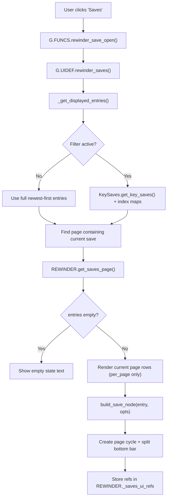

# Save List Render Flow

Triggered when user opens the Saves panel from the in-run Options menu.

---

## Entry Point

`G.UIDEF.rewinder_saves()` in `UI/RewinderUI.lua`

---

## Flow Diagram



---

## Step-by-Step

### Step 1: Resolve Displayed Entries

`G.UIDEF.rewinder_saves()` calls:

```lua
local get_entries = REWINDER._get_displayed_entries or REWINDER.get_save_files
local entries = get_entries()
```

Behavior:
- Filter off: full newest-first list from SaveManager
- Filter on: key-only list + map caches
  - `_key_save_index_map`: filtered index -> original index
  - `_key_save_reverse_map`: original index -> filtered index

---

### Step 2: Initial Page Selection

Initial page uses the current save index in the active view:
- Full list: use `current_index`
- Filtered list: translate through `_key_save_reverse_map`
- If current save not present in filtered set: page 1

Meta-window recentering for page load only runs when filter is off.

---

### Step 3: Page Rendering (`get_saves_page`)

Only renders visible rows for the active page (`per_page = 8`), not full list.

For each visible entry:
- lazy-load metadata if needed
- build row via `build_save_node(entry, opts)`

Empty state is mode-aware:
- filter off -> `rewinder_no_saves`
- filter on -> `rewinder_no_key_saves`

---

### Step 4: Row Rendering (`build_save_node`)

Entry format is 13 fields (see `CACHE_ENTRY_EXAMPLE.md`), including:
- `ENTRY_IS_CURRENT`
- `ENTRY_DISPLAY_TYPE`
- `ENTRY_ORDINAL`
- `ENTRY_IS_KEY`

Row behavior:
- Current row: orange background + white triangle indicator
- Key row: teal background
- Mark mode (`_mark_active == true`):
  - row button callback switches to `rewinder_save_toggle_key`
  - key-state preview uses `KeySaves.effective_is_key(entry)`
  - pending change marker shown as `[?]`

---

### Step 5: Bottom Action Bar (Current Layout)

Bottom bar is split into two halves:
- Left half: `rewinder_btn_filter_keys` (text button)
- Right half: two icon buttons centered together:
  - `rewinder_btn_mark_keys` (star icon)
  - `rewinder_btn_jump_to_current` (triangle icon)

Icon buttons use:
- shared size constants (`ICON_BUTTON_SIDE`, `ICON_BUTTON_ICON_SIZE`, etc.)
- light-grey outer border wrapper
- inner fill node for actual color
  - mark fill: key color (browse) or red (mark mode)
  - jump fill: orange

---

## Mode/Callback Behaviors

### Mark button (`rewinder_btn_mark_keys`)

- Off -> On: enters mark mode
- On -> Off: commits pending key changes via `KeySaves.commit_pending()`
- Closing overlay while mark mode is active discards pending changes
- Detailed pending/commit/discard semantics are documented in `KEY_SAVES_FLOW.md`

### Filter button (`rewinder_btn_filter_keys`)

- Toggles key-only filter view
- Always refreshes to page containing current save in active view
- If current save does not exist in filtered list, opens page 1
- Filter mode persists across close/open
- Key-save data semantics for filtering are documented in `KEY_SAVES_FLOW.md`

### Jump button (`rewinder_save_jump_to_current`)

- Computes target page from current save index in active view
- In filter mode, uses reverse map translation
- Falls back to page 1 when current save is absent from filtered entries

---

## Controller Navigation

`Utils/Keybinds.lua` custom navigation order for bottom row:
- `rewinder_btn_filter_keys` <-> `rewinder_btn_mark_keys` <-> `rewinder_btn_jump_to_current`

Additional overlay shortcuts:
- `LB` / `RB`: prev/next page
- `Y`: jump to current

---

## Performance Notes

- Page render cost stays O(per_page), not O(total entries)
- Filter view creation is O(N) over current full list (expected small-medium N)
- Current-save page targeting is O(1) after index-map setup
- Metadata remains lazy-loaded (on-demand per visible entry)

---

## Related Files

- `UI/RewinderUI.lua` — layout and row rendering
- `UI/ButtonCallbacks.lua` — mode toggles, jump/page refresh, close behavior
- `Utils/Keybinds.lua` — controller navigation and bottom-row focus order
- `Core/KeySaves.lua` — key-state effective/pending logic
- `Core/SaveManager.lua` — entry source and index helpers
